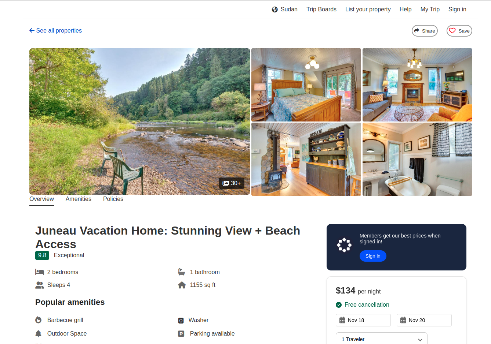

# JavaScript ASSIGNMENT


# 🏡 Vacation Home Rental Landing Page

A responsive and modern landing page for vacation home rentals. This project provides an attractive and functional interface for users to browse properties, check amenities, view house rules, and make bookings.



## 📜 Table of Contents

- [About the Project](#about-the-project)
- [Features](#features)
- [Technologies Used](#technologies-used)
- [Getting Started](#getting-started)
- [Installation](#installation)
- [Usage](#usage)
- [Contributing](#contributing)
- [License](#license)

---

## About the Project

The **Vacation Home Rental Landing Page** is designed to showcase properties available for short-term rentals. It provides a clean and user-friendly interface where guests can explore properties, check house rules, and view essential information like check-in/check-out times and property amenities.

This project is suitable for anyone looking to develop a vacation rental or property listing platform, or for learning HTML, CSS, and JavaScript basics in a responsive design.

## Features
- ☰ **Responsive Navbar** - Navbar is Hiddine in mobile view. It pops up clicking user icon.
- 🌍 **Responsive Region and Currency Selection** - User can select region and currency of their choice.
- ➦ **Responsive Share and Copy Link Options** - User can Copy link and share the content.
- 📂 **Save Option** - User can save the content and the state is not change on reloading the webpage.
- 🖼️ **Full Gallery and Image View** - User can see the full image gallery and full image from the gallery. They can also see the previous image and next image from the full image view.
- 👨‍👩‍👦‍👦 **Travelers Selection** - User can select the desire number of travelers to book the rooms and see the pricing. The least number of travelers is set to 1 adults.
- 🏠 **Property Listings** - Showcase various properties with images and descriptions.
- 🔍 **Search Functionality** - Users can filter properties by location, dates, and number of guests.
- 📅 **Availability Calendar** - Integrated calendar to display booking availability.
- 📌 **Interactive Map** - Show location of properties using Google Maps.
- 🛏️ **Amenities Display** - List of amenities with icons (e.g., WiFi, air conditioning).
- 🔒 **House Rules** - Important rules for guests (check-in time, smoking policy, etc.)
- 📱 **Responsive Design** - Fully responsive design to ensure usability on mobile, tablet, and desktop devices.

## Technologies Used

- **HTML5** - Semantic structure and layout
- **CSS3** - Styling and animations
- **JavaScript** - Adding Functionality
- **Font Awesome** - Icon library for amenities and other features
- **Google Maps API** - For displaying property locations on a map

## Getting Started

To get a local copy up and running, follow these steps.

### Prerequisites

- A web browser (e.g., Chrome, Firefox)
- Code editor (e.g., VS Code)
- [Node.js and npm](https://nodejs.org/) (if you plan to add further features or use build tools)

### Installation

1. **Clone the repo:**
   ```bash
   git clone https://github.com/Marjia029/W3_JavaScript_Assignment.git
   cd W3_JavaScript_Assignment
2. **Open [index.html](./index.html) file with web browser or [Click here](https://marjia029.github.io/HTML_CSS_Assignment/) to see the webpage.**